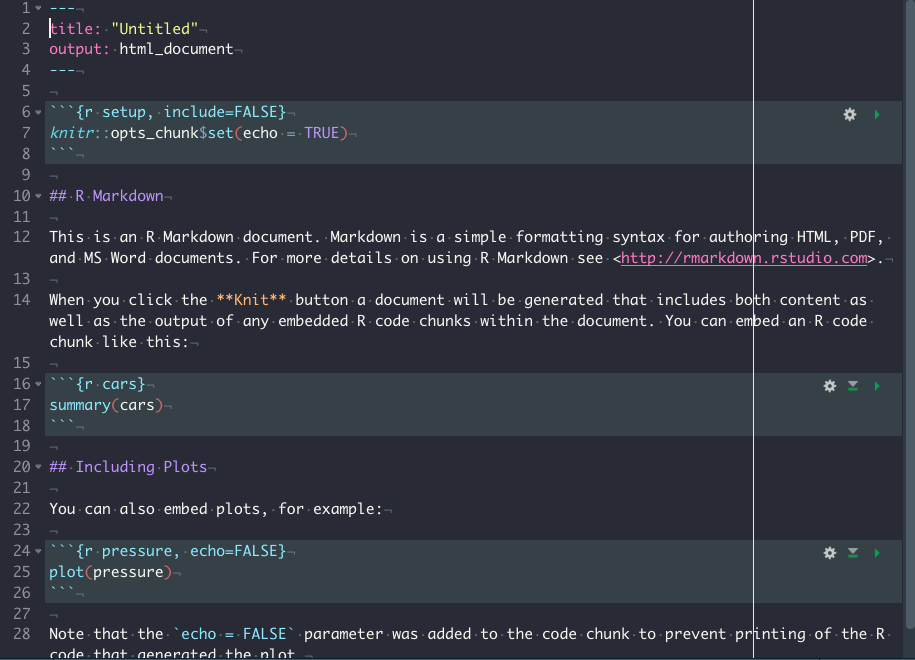
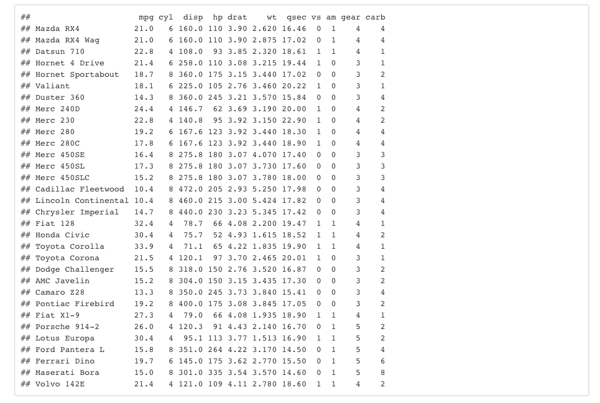
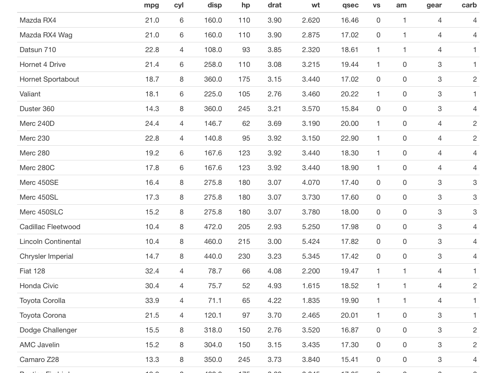
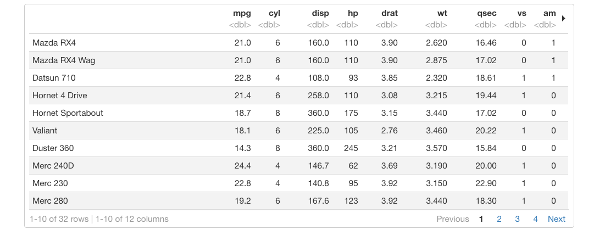

# Rmarkdown {#rmarkdown}

Rmarkdown是Rstudio公司出品的.所有markdown的语法都支持.但是加入了很多强大的功能,因此可以做更多原生markdown无法完成的任务.成为数据分析以及报告自动化和重复化领域一个非常常用的工具.

可以参考下面的书,是rmarkdown的作者Yihui Xie写的.

https://bookdown.org/yihui/rmarkdown/installation.html


也可以查看这个视频简介.

<iframe src="https://player.vimeo.com/video/178485416?color=428bca&title=0&byline=0&portrait=0" width="640" height="400" frameborder="0" allow="autoplay; fullscreen" allowfullscreen></iframe>
<p><a href="https://vimeo.com/178485416">What is R Markdown?</a> from <a href="https://vimeo.com/rstudioinc">RStudio, Inc.</a> on <a href="https://vimeo.com">Vimeo</a>.</p>

## 安装

需要安装R和Rstudio.

```markdown
install.packages('rmarkdown')
```

如果想要转换为PDF格式,需要安装LaTex.

```markdown
install.packages("tinytex")
tinytex::install_tinytex()  # install TinyTeX
```

## Rmarkdown结构

Rmarkdown可以分为三部分,分别是`YAML`, `文本部分`以及`代码块`.

1. YAML

YAML在每个rmakdown文件的最开头,定义了Markdown文件的很多性质.YAML是指YAin’t Markup Language, https://en.wikipedia.org/wiki/YAML.

```markdown
---
title: "Hello R Markdown"
author: "Awesome Me"
date: "2018-02-14"
output: html_document
---
```

YAML用`---`包围起来.

2. 文本部分

YAML下面就是文本部分,其实也就是Markdown.

3. 代码块

在Rmarkdown中,可以插入可以执行的代码块,不近包括R,还包括pyton,SQL等等.



上图显示的就是一个完整的Rmarkdown文件.

## YAML

`YAML`是在Rmakdown中控制很多内容的部分.通过参数设置,可以控制比如输入格式,输出主题等等.

## R代码块

R代码块的格式为:

````markdown
`r ''````{r}
library(tidyverse)
library(ggplot2)
```
````

可以看到,跟markdown代码块唯一的不同就是需要使用`{r}`来定义该代码块为R语言.除此之外,可以通过在大括号中设置一系列的参数,来控制代码块的输出.包括文本输出,图片输出以及表格输出等.

比如,可以通过设置`result = 'hide'`从而使文本结果不输出.也可以通过设置`fig.width`和`fig.height`来控制输出图片的宽度和高度.

另外还可以通过`eval`参数(evaulate)来控制代码块是否执行,如果设置为`FALSE`,则代码块不会执行.

比如:

下面这段代码就会执行,并输出结果.

````markdown
`r ''````{r, eval = TRUE}
library(ggplot2)
ggplot(mtcars, aes(x = mpg, y = wt, 
color = gear)) + 
geom_point() + theme_bw()
```
````

```{r, eval = TRUE, echo = FALSE}
library(ggplot2)
ggplot(mtcars, aes(x = mpg, y = wt, 
color = gear)) + 
geom_point() + theme_bw()
```

而这段代码则不会执行

````markdown
`r ''````{r, eval = FALSE}
library(ggplot2)
ggplot(mtcars, aes(x = mpg, y = wt, 
color = gear)) + 
geom_point() + theme_bw()
```
````

```{r, eval = FALSE, echo = FALSE}
library(ggplot2)
ggplot(mtcars, aes(x = mpg, y = wt, 
color = gear)) + 
geom_point() + theme_bw()
```


## 代码块参数 (Chunk options)

代码块有非常多的参数(chunk options),常用的总结如下,完整的可以在yihui xie的博客中.

https://yihui.org/knitr/options/

### 代码是否执行

* `eval`:设置为TRUE或者FALSE来控制代码块是否执行.

###文本输出结果

* `echo`:设置为TRUE或者FALSE,控制代码块是否显示在最终的渲染结果中.

* `results`:
 
   - `markup`:mark up the results using the output hook, e.g. put results in a special LaTeX environment.
 
   - `asis`:将R原始结果输出到最终文本中.
 
   - `hide`:隐藏R执行结果,但是对error,message和warning没有作用.
* `collapse`:设置为TRUE或者FALSE.用来控制文本输出结果是否和代码块混在一起.

* `warning`:设置为TRUE或者FALSE.如果代码执行,是否显示其中的warning信息.

* `error`:设置为TRUE或者FALSE.如果设置为TRUE,即使代码执行出现错误,仍然会输出渲染结果,如果设置为FALSE,代码执行错误,则渲染也会出错,不会在继续输出结果.

* 'message': 设置为TRUE或者FALSE.代码执行时是否输出message信息.

* `include`:是否将代码输出结果显示在最终的渲染输出文本中.

显示代码和输出结果:

````markdown
`r ''````{r, eval = TRUE, include = TRUE}
library(ggplot2)
library(tidyverse)

mtcars %>% 
ggplot(aes(x = gear, cyl)) + 
geom_point() + 
theme_bw()
```
````

```{r, eval = TRUE, include = TRUE}
library(ggplot2)
library(tidyverse)

mtcars %>% 
ggplot(aes(x = gear, cyl)) + 
geom_point() + 
theme_bw()
```

显示代码不显示输出结果:

````markdown
`r ''````{r, eval = TRUE, include = FALSE}
library(ggplot2)
library(tidyverse)

mtcars %>% 
ggplot(aes(x = gear, cyl)) + 
geom_point() + 
theme_bw()
```
````

```{r, eval = TRUE, include = FALSE}
library(ggplot2)
library(tidyverse)

mtcars %>% 
ggplot(aes(x = gear, cyl)) + 
geom_point() + 
theme_bw()
```


* `strip.white`:设置为TRUE或者FALSE.是否输出在最终输出渲染结果中代码块上下的白线.

````markdown
`r ''````{r, eval = FALSE, strip.white = TRUE}
library(ggplot2)
library(tidyverse)

mtcars %>% 
ggplot(aes(x = gear, cyl)) + 
geom_point() + 
theme_bw()
```
````

```{r, eval = FALSE, strip.white = TRUE, echo = FALSE}
library(ggplot2)
library(tidyverse)

mtcars %>% 
ggplot(aes(x = gear, cyl)) + 
geom_point() + 
theme_bw()
```


````markdown
`r ''````{r, eval = FALSE, strip.white = FALSE}
library(ggplot2)
library(tidyverse)

mtcars %>% 
ggplot(aes(x = gear, cyl)) + 
geom_point() + 
theme_bw()
```
````

```{r, eval = FALSE, strip.white = FALSE, echo = FALSE}
library(ggplot2)
library(tidyverse)

mtcars %>% 
ggplot(aes(x = gear, cyl)) + 
geom_point() + 
theme_bw()
```


###  代码控制 (code decoration)

* `tidy`:
  - `TRUE`:使用`formatR`对代码格式进行整理.
  - `FALSE`:保持原格式.
  - `styler`:使用`styler`包对代码格式进行整理.

* `comment`:默认为`##`,表示对于R代码输出的文本结果前面会有`##`进行注释.

* `highlight`:逻辑值.是否对代码进行高亮.

````markdown
`r ''````{r, eval = FALSE, highlight = TRUE}
library(ggplot2)
library(tidyverse)

mtcars %>% 
ggplot(aes(x = gear, cyl)) + 
geom_point() + 
theme_bw()
```
````

```{r, eval = FALSE, highlight = TRUE, echo = FALSE}
library(ggplot2)
library(tidyverse)

mtcars %>% 
ggplot(aes(x = gear, cyl)) + 
geom_point() + 
theme_bw()
```

### 缓冲 (cache)

`cache`:逻辑值.是否需要缓冲代码块运行结果,对于代码运行时间比较长的rmakdown文件,可以设置为TRUE,这样重新渲染的时候,会减少运行时间.

`cache.path`:默认为'cache/',设置如果缓冲为TRUE时,缓冲结果存储的文件夹位置.

### 图像控制(plot)

* `fig.path`:默认为'figure/',用来设置生成figure的存储位置.

* `fig.show`:如何显示plot.

   - `asis`: plot在产生他们的代码后面.
   
   - `hold`:所有代码产生的图片都放在一个完整的代码块之后.
   
   - `animate`: 将所有产生的图片合成一个动画图片.
   
   - `hide`:产生所有图片,但是并不展示.
   
   
````markdown
`r ''````{r, eval = TRUE, fig.show = 'asis'}
library(ggplot2)
library(tidyverse)
library(ggsci)
#plot1 
mtcars %>% 
ggplot(aes(x = mpg, y = disp, color = as.character(gear))) + 
geom_point() + 
ggsci::scale_color_aaas() +
theme_bw()

#plot2
mtcars %>% 
ggplot(aes(x = mpg, y = disp, color = as.character(gear))) + 
geom_point() + 
ggsci::scale_color_ucscgb() +
theme_bw()

#plot3
mtcars %>% 
ggplot(aes(x = mpg, y = disp, color = as.character(gear))) + 
geom_point() + 
ggsci::scale_color_igv() +
theme_bw()
```
````

```{r, eval = TRUE, fig.show = 'asis', echo = FALSE}
library(ggplot2)
library(tidyverse)
library(ggsci)
#plot1 
mtcars %>% 
ggplot(aes(x = mpg, y = disp, color = as.character(gear))) + 
geom_point() + 
ggsci::scale_color_aaas() +
theme_bw()

#plot2
mtcars %>% 
ggplot(aes(x = mpg, y = disp, color = as.character(gear))) + 
geom_point() + 
ggsci::scale_color_ucscgb() +
theme_bw()

#plot3
mtcars %>% 
ggplot(aes(x = mpg, y = disp, color = as.character(gear))) + 
geom_point() + 
ggsci::scale_color_igv() +
theme_bw()
```


````markdown
`r ''````{r, eval = TRUE, fig.show = 'hold'}
library(ggplot2)
library(tidyverse)
library(ggsci)
#plot1 
mtcars %>% 
ggplot(aes(x = mpg, y = disp, color = as.character(gear))) + 
geom_point() + 
ggsci::scale_color_aaas() +
theme_bw()

#plot2
mtcars %>% 
ggplot(aes(x = mpg, y = disp, color = as.character(gear))) + 
geom_point() + 
ggsci::scale_color_ucscgb() +
theme_bw()

#plot3
mtcars %>% 
ggplot(aes(x = mpg, y = disp, color = as.character(gear))) + 
geom_point() + 
ggsci::scale_color_igv() +
theme_bw()
```
````

```{r, eval = TRUE, fig.show = 'hold', echo = FALSE}
library(ggplot2)
library(tidyverse)
library(ggsci)
#plot1 
mtcars %>% 
ggplot(aes(x = mpg, y = disp, color = as.character(gear))) + 
geom_point() + 
ggsci::scale_color_aaas() +
theme_bw()

#plot2
mtcars %>% 
ggplot(aes(x = mpg, y = disp, color = as.character(gear))) + 
geom_point() + 
ggsci::scale_color_ucscgb() +
theme_bw()

#plot3
mtcars %>% 
ggplot(aes(x = mpg, y = disp, color = as.character(gear))) + 
geom_point() + 
ggsci::scale_color_igv() +
theme_bw()
```

````markdown
`r ''````{r, eval = TRUE, fig.show = 'animate'}
library(ggplot2)
library(tidyverse)
library(ggsci)
#plot1 
mtcars %>% 
ggplot(aes(x = mpg, y = disp, color = as.character(gear))) + 
geom_point() + 
ggsci::scale_color_aaas() +
theme_bw()

#plot2
mtcars %>% 
ggplot(aes(x = mpg, y = disp, color = as.character(gear))) + 
geom_point() + 
ggsci::scale_color_ucscgb() +
theme_bw()

#plot3
mtcars %>% 
ggplot(aes(x = mpg, y = disp, color = as.character(gear))) + 
geom_point() + 
ggsci::scale_color_igv() +
theme_bw()
```
````

```{r, eval = TRUE, fig.show = 'animate', echo = FALSE}
library(ggplot2)
library(tidyverse)
library(ggsci)
#plot1 
mtcars %>% 
ggplot(aes(x = mpg, y = disp, color = as.character(gear))) + 
geom_point() + 
ggsci::scale_color_aaas() +
theme_bw()

#plot2
mtcars %>% 
ggplot(aes(x = mpg, y = disp, color = as.character(gear))) + 
geom_point() + 
ggsci::scale_color_ucscgb() +
theme_bw()

#plot3
mtcars %>% 
ggplot(aes(x = mpg, y = disp, color = as.character(gear))) + 
geom_point() + 
ggsci::scale_color_igv() +
theme_bw()
```

* `dpi`:输出图片dpi,默认72.(dpi * inches = pixels)

* `fig.width`和`fig.height`:输出图片宽度和高度,默认为7(单位英寸).

* `fig.asp`:图片的高宽比.默认为NULL.如果设置为数值,比如设置为0.7.则`fig.height`会被覆盖,然后设置为fig.width*fig.asp.

* `out.width`和`out.height`:默认为NULL.可以设置为`100%`,这样在最终的渲染结果中就是和页面宽度一致.

* `fig.align`:图片的align位置.默认为`left`,可以为`right`或者`center`.

* `fig.cap`:图片标题.设置为NA或者NULL,则没有.

* `fig.subcap`:图片副标题.

## 全局代码块参数

如果某些代码块参数在全局中都是一样的,可以在全局进行设置.

在YAML下以及所有的markdown文本之上,插入下列代码块.

````markdown
`r ''````{r, include = FALSE}
knitr::opts_chunk$set(fig.width = 8, collapse = TRUE)
```
````

使用的是`knitr`包中的`opts_chunk$set()`函数.可以将比较常见常用的代码块设置在这里进行设置.这里就是全局的设置.

## 具体问题的cookbook

1. 输出两幅图,并且并列排布

结合代码块参数`fig.show`(设置为`hold`)和`out.width`(设置为`50%`).

````markdown
`r ''````{r, eval = TRUE, fig.show = 'hold', out.width = '50%'}
library(ggplot2)
library(tidyverse)
library(ggsci)
#plot1 
mtcars %>% 
ggplot(aes(x = mpg, y = disp, color = as.character(gear))) + 
geom_point() + 
ggsci::scale_color_aaas() +
theme_bw()

#plot2
mtcars %>% 
ggplot(aes(x = mpg, y = disp, color = as.character(gear))) + 
geom_point() + 
ggsci::scale_color_ucscgb() +
theme_bw()
```
````

```{r, eval = TRUE, echo = FALSE, fig.show = 'hold', out.width = '50%'}
library(ggplot2)
library(tidyverse)
library(ggsci)
#plot1 
mtcars %>% 
ggplot(aes(x = mpg, y = disp, color = as.character(gear))) + 
geom_point() + 
ggsci::scale_color_aaas() +
theme_bw()

#plot2
mtcars %>% 
ggplot(aes(x = mpg, y = disp, color = as.character(gear))) + 
geom_point() + 
ggsci::scale_color_ucscgb() +
theme_bw()
```


## Rmarkdown特有语法

Rmarkdown相比markdown来说,因为可以直接运行代码,因此有一些特有的语法,比如插入图片等.

### 图片 (image)

使用`knitr::include_graphics()`函数可以直接插入图片,然后使用代码块参数可以对图片进行设置,宽度高度,对齐等等.

````markdown
`r ''````{r, eval = TRUE, fig.show = 'hold', out.width = '50%', fig.align = 'center', fig.cap = "小涛"}

```
````

```{r, eval = TRUE, echo = FALSE, fig.show = 'hold', out.width = '50%', fig.align = 'center', fig.cap = "小涛"}

```

### 表格 (Table)

* `knitr::ktable()`函数

````markdown
`r ''````{r, eval = TRUE}
knitr::kable(iris[1:5, ], caption = 'A caption')
```
````

````{r, echo = FALSE, eval = TRUE}
knitr::kable(iris[1:5, ], caption = 'A caption')
```

该函数又很多参数可以用来控制输出表格的格式,具体的可以参考帮助文档.也可以参考下面的帖子:

https://cran.r-project.org/web/packages/kableExtra/vignettes/awesome_table_in_html.html


### 地图 (map)

使用`leaflet`包可以插入地图.

````markdown
`r ''````{r out.width='100%', echo=FALSE}
library(leaflet)
leaflet() %>% addTiles() %>%
  setView(-93.65, 42.0285, zoom = 17) %>%
  addPopups(
    -93.65, 42.0285,
    'Here is the <b>Department of Statistics</b>, ISU'
  )
```
````

```{r out.width='100%', echo=FALSE}
library(leaflet)
leaflet() %>% addTiles() %>%
  setView(-122.176758, 37.432748, zoom = 17) %>%
  addPopups(
    -122.176758, 37.432748,
    'Here is the <b>Snyder lab</b>, Stanford University'
  )
```


## 输出格式

### HTML格式

Markdown最最开始就是就是为输出为HTML格式涉及的.在Rmarkdown中,如果想要输出位HTML格式,需要在`YAML`中将output设置为`html_document`即可.

````markdown
---
title: Test
author: Xiaotao Shen
date: March 22, 2005
output: html_document
---
````

1. 目录(Table of contents)

想要给文章设置目录,可以在`html_document`下设置`toc`参数,同时也可以设置`toc_depth`来设置几级目录.

比如下面的例子:

````markdown
---
title: "Habits"
output:
  html_document:
    toc: true
    toc_depth: 2
---
````

如果想要让目录浮在页面上,可以设置`toc_float`参数.比如下面的例子:

````markdown
---
title: "Habits"
output:
  html_document:
    toc: true
    toc_float: true
---
````

同时`toc_float`参数还有自己的参数可以进行设置.

* `collapsed`:逻辑值.控制目录是否可以进行折叠.

* `smooth_scroll`:逻辑值.controls whether page scrolls are animated when TOC items are navigated to via mouse clicks.

例如:

````markdown
---
title: "Habits"
output:
  html_document:
    toc: true
    toc_float:
      collapsed: false
      smooth_scroll: false
---
````

2. 标题编号(Section numbering)

可以使用`number_sections`参数来控制标题的编号.

例如:

````markdown
---
title: "Habits"
output:
  html_document:
    toc: true
    number_sections: true
---
````

3. 外观和风格

有几个参数可以来控制HTML document的外观.

* `theme`参数可以用来控制HTML document的外观和主题.来自于[Bootswatch](https://bootswatch.com/3/cosmo/).可以选择的主题包括以下几项:
`default`, `cerulean`, `journal`, `flatly`, `darkly`, `readable`, `spacelab`, `united`, `cosmo`, `lumen`, `paper`, `sandstone`, `simplex`, and `yeti`.可以点击到网站中去查看几种主题的外观.

* `highlight`用来控制语法高亮的风格.包括以下几种: 
`default`, `tango`, `pygments`, `kate`, `monochrome`, `espresso`, `zenburn`, `haddock`, `breezedark`, and `textmate`.

4. 表格打印

可以使用`df_print`参数来控制表格打印的风格.在R代码块中的数据框直接显示的风格.

* `default`: 使用R中`print.data.frame`方法.

* `kable`: 使用`knitr::kable`函数.

* `tibble`: 使用`tibble::print.tbl_df`函数,

* `paged`:使用`rmarkdown::paged_table`函数.


````markdown
---
title: "Motor Trend Car Road Tests"
output:
  html_document:
    df_print: default
---

`r ''````{r}
mtcars
```
````

显示结果如下:



如果设置为`kable`:



如果设置为`paged`:



5. 代码折叠

可以通过设置`code_folding`为`hide`,这样所有的代码默认都是折叠的,然后用户可以通过点击按钮显示某个代码块.

````markdown
---
title: "Habits"
output:
  html_document:
    code_folding: hide
---
````

6. 其他一些高级设置

* 通过使用`includes`参数,可以在rmarkdown的某些位置加入一些自己设计好的HTML元素.

````markdown
---
title: "Habits"
output:
  html_document:
    includes:
      in_header: header.html
      before_body: doc_prefix.html
      after_body: doc_suffix.html
---
````
* 自定义主题

如果对HTML比较熟悉,可以使用自己的主题.

````markdown
---
title: "Habits"
output:
  html_document:
    template: quarterly_report.html
---
````


### PDF格式

Rmarkdown也可以输出为PDF格式的文档.设置output为`pdf_document`.

````markdown
---
title: "Habits"
output:
  pdf_document:
    highlight: tango
---
````

PDF格式的目录,图片设置,数据框打印,语法高亮都跟HTML相同.

### Word格式

也可以输出为word格式,设置output为`word_document`.

````markdown
---
title: "Habits"
author: John Doe
date: March 22, 2005
output: word_document
---
````
word的格式可以使用默认的格式,当然也可以自己进行设置.设置好格式之后,使用`reference_docx`参数进行设置.

````markdown
---
title: "Habits"
output:
  word_document:
    reference_docx: my-styles.docx
---
````

如何设置格式文件,可以参考下面文章:

https://rmarkdown.rstudio.com/articles_docx.html

或者看下面的视频:

<iframe src="https://player.vimeo.com/video/110804387" width="640" height="400" frameborder="0" allow="autoplay; fullscreen" allowfullscreen></iframe>
<p><a href="https://vimeo.com/110804387">Create A MS Word Template for R Markdown</a> from <a href="https://vimeo.com/yihui">Yihui Xie</a> on <a href="https://vimeo.com">Vimeo</a>.</p>

